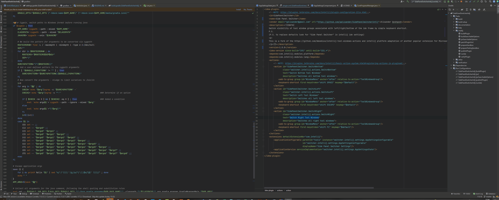
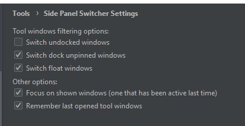

Side Panel Switcher
====================================

Allows switching visibility of tool window groups associated with left/right/bottom of the ide frame by simple keyboard shortcut.

Default shortcuts:
- `shift + space` - switch bottom tool windows
- `shift + F1` - switch right tool windows
- `shift + esc` - switch left tool windows

This is a fork of the [intellij-tool-windows-actions](https://github.com/dmoebius/intellij-tool-windows-actions) and intellij platform adaptation of another [popular extension](https://marketplace.visualstudio.com/items?itemName=qalisander.SidePanelSwitcher) for Microsoft Visual Studio.

The plugin should work on all IDEA apps. 
Tested in IntelliJ IDEA, PyCharm, Rider, CLion, DataGrip.

### How and Why
Sometimes it's convenient to group tool windows of a same purpose on single side of ide frame (like project files, file structure, bookmarks on the left, precommit tool window, vcs history on the right, everything related to debugging on the bottom).

But there's no default way in ide to show/hide all windows in group simultaneously.
So here is the extension may help and especially helpful when you have some extra space on your screen just like myself (ultrawide monitor).

### Features
- Filtering by undocked/dock unpinned/float tool windows
- Focusing on last focused tool window next after showing tool window group
- Persistent saving of last shown tool windows
  
Filtering and other options available in `Tools > Side Panel Switcher Settings`.

This is a fork of the [intellij-tool-windows-actions extension](https://github.com/dmoebius/intellij-tool-windows-actions) and intellij platform adaptation of another [popular extension](https://marketplace.visualstudio.com/items?itemName=qalisander.SidePanelSwitcher) for Microsoft Visual Studio

Any help with bug reports or PR's is appreciated.